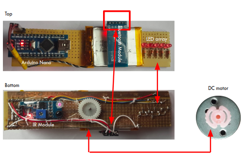
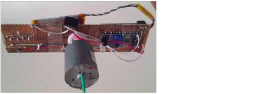
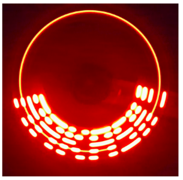

# povDisplay
***

This project expoits the phenomena of persistence of vision associated with human eye to display text using an array of just 5 LEDs. Persistence of vision is the property of vision due to which the sensation of image formed on retina of our eyes persists in our brain for 1/10  sec. If any other image is formed on retina before that then we are unable to differentiate between those images.
**Authors:** Aakash Yadav

### Environment setup
The following enviornemt was used to build the app
  - Arduino IDE 1.8.1 or higher (for Windows 10)
  - Mobile device (tested on Android) 

### Required components 
  - Arduino Nano
  - Bluetooth module (for app communication)
  - IR module 
  - LiPo battery (3.7v 900mAh) and charger
  - DC motor (4600rpm ideal)
  - PCB proof board
  - 5mm LED’s, resistors & soldering station 
  

### Features

  - Bluetooth control
  - Less vibrations
  
### Hardware and Electronics build 
  

### Result
Displayed text - 'AAKASH'

